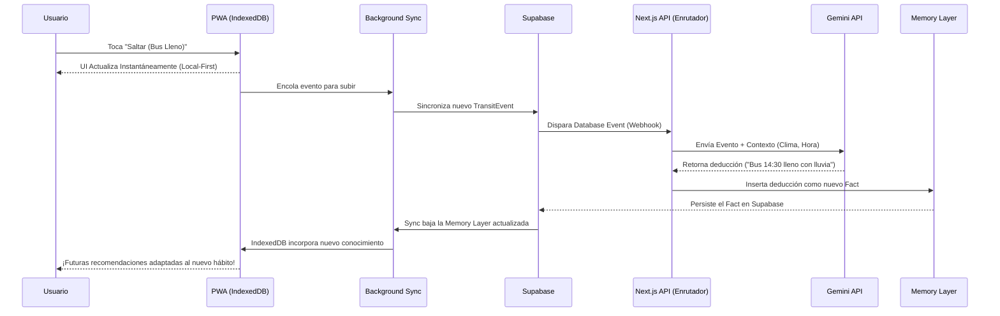

# LifeOS: Arquitectura Técnica Definitiva

Este documento describe la arquitectura final de LifeOS, diseñada para ser rápida, resiliente y altamente inteligente. La plataforma se basa en un enfoque Local First soportado por una potente infraestructura en la nube dirigida por eventos y automatización.

## 1. Filosofía Core

### Local-First y Offline-First
La experiencia del usuario nunca debe depender de la conectividad de red. LifeOS prioriza el dispositivo local como la fuente de verdad principal:
- **Lecturas y Escrituras Instantáneas:** Todas las interacciones de la UI (React/Next.js) leen y escriben directamente en una base de datos local en el navegador (**IndexedDB**).
- **Disponibilidad Offline:** La aplicación funciona al 100% sin internet.
- **Background Sync:** Mediante Service Workers y la API de Background Sync, el estado local se sincroniza silenciosamente con la nube en segundo plano cuando la conexión se restablece.

## 2. Capas de la Arquitectura

### Capa Cliente (Frontend y Persistencia Local)
- **Next.js (App Router):** Maneja el renderizado de la PWA y rutas API delgadas.
- **IndexedDB:** Base de datos reactiva local (utilizando librerías como RxDB o WatermelonDB) que nutre la interfaz de usuario en tiempo real.

### Capa de Datos en la Nube
- **Supabase (PostgreSQL):** Funciona como la base de datos remota autoritativa. Se encarga de la persistencia segura a largo plazo y de la sincronización multi-dispositivo.
- **Database Events:** Supabase utiliza Triggers de base de datos y Webhooks para reaccionar a cualquier cambio (inserción, actualización, eliminación) y notificar al resto del sistema.

### Capa de Automatización (Nervous System)
- **Next.js Backend:** El motor de flujos de trabajo central. Escucha los Database Events de Supabase y actúa como enrutador en la **Event Driven Architecture**. Conecta la base de datos con APIs externas (clima, transporte, calendarios) y con los modelos de inteligencia artificial.

### Capa de Inteligencia (Cerebro)
- **Gemini API:** Modelos LLM encargados del procesamiento de lenguaje natural, toma de decisiones complejas, extracción de entidades y reconocimiento de patrones.
- **Memory Layer:** Un esquema de base de datos especializado dentro de Supabase (posiblemente utilizando `pgvector`) que almacena "hechos", "hábitos" y contexto histórico para dotar de memoria a largo plazo a la IA.

---

## 3. Diagrama de Arquitectura Global

```mermaid
graph TD
    subgraph Client [Client Device / PWA]
        UI[User Interface]
        LocalDB[(IndexedDB)]
        SW[Background Sync / Service Worker]
        UI <-->|Reads/Writes (Instant)| LocalDB
        LocalDB <-->|Sync| SW
    end

    subgraph Cloud [Cloud Infrastructure]
        Supabase[(Supabase / PostgreSQL)]
        Realtime[Database Events / Webhooks]
        Supabase --> Realtime
    end

    subgraph Automation [Automation Layer]
        BACKEND[Next.js API Routes]
    end

    subgraph AI [Intelligence Layer]
        Gemini[Google Gemini API]
        Memory[(Memory Layer / pgvector)]
    end

    SW <-->|Network Sync| Supabase
    Realtime -->|Triggers| BACKEND
    BACKEND <-->|Prompts & Context| Gemini
    BACKEND <-->|Reads/Writes Facts| Memory
    Memory -.->|Stored in| Supabase
```

---

## 4. Flujo End-to-End: Del Botón al Conocimiento

Para comprender el diseño Event-Driven, aquí se detalla el ciclo de vida completo de la información, desde que el usuario interactúa con LifeOS hasta que la Inteligencia Artificial aprende un nuevo conocimiento.

**Caso de Uso:** El usuario decide no tomar el colectivo recomendado y pulsa el botón *"Saltar (Bus Lleno)"*.

1. **Acción del Usuario:** El usuario toca el botón en la UI de la PWA.
2. **Escritura Local (Local First):** El evento se guarda instantáneamente en **IndexedDB**. La UI reacciona sin demoras, ocultando el colectivo y mostrando el siguiente.
3. **Sincronización en Segundo Plano:** El Service Worker (Background Sync) detecta que hay un nuevo evento local sin subir y lo sincroniza hacia la nube en el momento que haya red disponible.
4. **Llegada a Supabase:** El evento (`TransitEvent`) se inserta en la tabla de Supabase.
5. **Database Event (Trigger):** La inserción dispara un trigger en PostgreSQL. Supabase envía inmediatamente un Webhook hacia una **API Route de Next.js**.
6. **Enrutamiento y Enriquecimiento:** La **API Route** recibe el webhook. Extrae contexto adicional (por ejemplo, consulta la API del clima local para saber que está lloviendo fuertemente).
7. **Procesamiento de IA (Inferencia):** El backend envía el evento enriquecido a la **Gemini API**. Se le instruye buscar patrones.
8. **Creación del Conocimiento:** Gemini deduce una correlación: *"Cuando llueve fuerte, el bus de las 14:30 se llena más rápido"*.
9. **Guardado en Memory Layer:** El backend toma esta inferencia generada por Gemini y la inserta como un nuevo "Hecho" (Fact) estructurado en la **Memory Layer** dentro de Supabase.
10. **Aprendizaje Aplicado:** En la siguiente sincronización, este nuevo "Hecho" baja al dispositivo del usuario. La próxima vez que llueva, el motor de recomendación local de LifeOS leerá el IndexedDB y sugerirá automáticamente salir más temprano, completando el ciclo de aprendizaje.

### Diagrama del Flujo End-to-End


