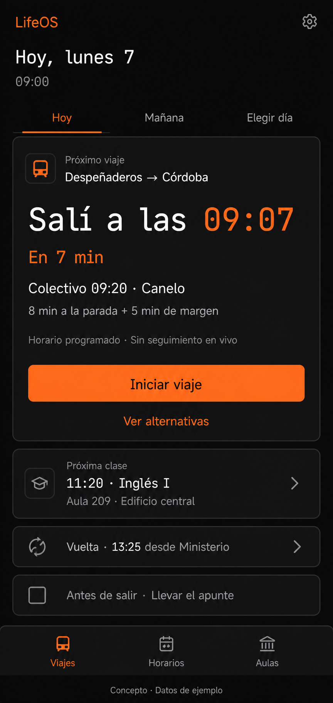

# LifeOS: mejoras útiles sin sobrecargar la pantalla

Fecha: 7 de septiembre de 2026. Destinatario: responsable de producto y equipo LifeOS.

Estado: propuesta de producto investigada; no implementada. La imagen usa datos de ejemplo.

## Qué agregaría primero

Haría que la pantalla principal responda tres preguntas: **¿cuándo salgo?, ¿qué tengo después?, ¿qué cambia hoy?** Las primeras incorporaciones serían la hora de salida personal, excepciones de cursado por fecha y alternativas que indiquen si todavía permiten llegar. Mantendría Viajes, Horarios y Aulas como navegación principal.

Antes de sumar contenido, compactaría la tarjeta del viaje que no toca ahora y llevaría la música al detalle del viaje. Ese espacio permitiría mostrar información nueva sin alargar la portada. Conservaría el fondo oscuro, el naranja y las horas monoespaciadas; simplificaría etiquetas como `SYS.DEP` o `STANDBY` a expresiones cotidianas.

La recomendación se apoya en mostrar primero las opciones frecuentes y revelar las secundarias a pedido, con accesos claramente nombrados. No implica esconder información necesaria para decidir. [Nielsen Norman Group: Progressive Disclosure](https://www.nngroup.com/articles/progressive-disclosure/).

## Punto de partida comprobado

Se leyeron los 24 documentos existentes en `docs`, se contrastaron con el código y se abrió la portada local en el navegador. La documentación incluye aspiraciones y auditorías históricas que no describen exactamente la versión actual.

| Ya existe | Evidencia en el proyecto | Consecuencia para la propuesta |
|---|---|---|
| Ida, vuelta, cuenta regresiva y selección manual entre alternativas | `src/app/page.tsx`, `src/features/schedule/HorarioCard.tsx` | Mejorar la decisión, sin crear otro listado de colectivos. |
| Registro BEC y resumen mensual | `src/hooks/useBec.ts`, `src/app/configuracion/page.tsx` | Mantenerlo; distinguirlo de haber subido al colectivo. |
| Materias editables y cronología del día | `src/hooks/useSubjects.ts`, `src/features/schedule/ClassTimeline.tsx` | Reutilizar los datos de clases y aulas. |
| Escenarios particulares de Arquitectura y dormir en Córdoba | `src/features/schedule/ContextualControls.tsx` | Extender a excepciones fechadas, sin borrar la rutina. |
| Indicador sin conexión, cola y observador de sincronización | `src/components/layout/Navbar.tsx`, `src/core/sync/` | Mejorar la información de estado; no asumir sincronización integral ya terminada. |
| Accesos a música entre la ida y las clases | `src/components/EntertainmentSelector.tsx`, `src/app/page.tsx` | Pasarlos al viaje activo o a un desplegable. |
| Código de clima | `src/hooks/useMicroClima.ts`, `src/core/services/weather/` | Evaluar su reutilización; no presentarlo como una tarjeta de portada ya integrada. |

El motor usa horarios de `src/data/schedules.ts`. Una cuenta regresiva actualizada cada minuto no acredita posición GPS ni demora real del colectivo. Además, la persistencia actual combina IndexedDB y localStorage; la existencia de infraestructura no demuestra el flujo completo hacia Supabase.

## Orden de prioridad

Orden cualitativo por utilidad diaria, espacio requerido y dependencias. El esfuerzo es relativo, no un presupuesto ni una estimación de días. No hay métricas de uso que permitan calcular un retorno numérico.

| Orden | Incorporación | Utilidad | Espacio permanente | Esfuerzo |
|---|---|---|---|---|
| 1 | Hora de salida personal y margen hasta el aula | Muy alta | Reemplaza el mensaje principal del viaje | Medio |
| 2 | Cambios de cursado solo por una fecha | Muy alta | Una línea cuando hay cambios | Medio |
| 3 | Plan alternativo y recuperación si perdés el colectivo | Muy alta | Dentro de las alternativas existentes | Medio |
| 4 | Próxima clase con acceso directo al detalle | Alta | Compacta la cronología existente | Bajo–medio |
| 5 | Estado comprensible de datos y sincronización | Alta | Una línea contextual | Medio; alto si requiere completar la sincronización |
| 6 | Recordatorios pequeños ligados al viaje o materia | Alta | Hasta una fila relevante | Medio |
| 7 | Aviso de salida activado por el usuario | Alta | Una acción dentro del detalle | Alto |
| 8 | Clima únicamente cuando cambia una decisión | Media | Una línea condicional en el viaje | Medio |

### 1. Hora de salida personal

**Agregar:** «Salí a las 09:07 · En 7 min», manteniendo debajo «Colectivo 09:20 · Canelo». Pedir una vez los minutos hasta la parada y el margen deseado en Configuración. Permitir valores distintos para ida y vuelta.

Ejemplo ilustrativo: 09:20 − 8 minutos caminando − 5 de margen = 09:07. También hay que considerar el traslado desde la bajada hasta el aula: llegar a Córdoba no equivale a estar en clase.

**Sin sobrecarga:** sustituir la jerarquía del contador existente. Los detalles del cálculo quedan bajo «Cómo se calcula». La hora del colectivo sigue visible.

**Implementación futura:** cálculo determinista en el motor, preferencias en IndexedDB y sincronización diferida. Gemini no interviene. El motor actual compara la llegada con el comienzo de clase; no alcanza para modelar todo el trayecto puerta a puerta.

**Aceptación:** distinguir salida de casa, paso por parada y llegada estimada; no mostrar urgencia de hoy al consultar otra fecha; resolver cruces de medianoche con fecha y zona horaria; si faltan minutos de traslado, indicar que falta configurar el cálculo personal. Una preferencia manual no debe ocultar una llegada tarde.

### 2. Excepciones de cursado por fecha

**Agregar:** en el detalle de una clase, «Cancelar solo esta clase», «Cambiar aula hoy» y «Cambiar horario hoy». El acceso puede llamarse «Cambiar esta fecha» para que también sirva al planificar mañana.

**Sin sobrecarga:** una línea «Hoy: Inglés cancelado» únicamente cuando exista una excepción. Mantener visibles el resultado y una acción para deshacer.

**Implementación futura:** separar la rutina semanal de la excepción, asociada a fecha local, materia y bloque concreto. El contexto actual basado en día de semana necesita esa ampliación: guardar solo “lunes” modificaría todos los lunes.

**Aceptación:** recalcular ida y vuelta; permitir deshacer; no modificar la semana siguiente; si todas las clases se cancelan, explicar por qué ya no se recomienda viajar. El usuario debe poder consultar horarios igualmente.

### 3. Plan alternativo útil

**Agregar:** «No llego a este» y alternativas con efecto concreto: «Llegada estimada 11:35 · 15 min después del inicio». Si ninguna sirve, decirlo explícitamente.

**Sin sobrecarga:** reutilizar «Opciones alternativas». Mostrar primero dos opciones relevantes y dejar «Ver todos los horarios» para el listado completo. Dos es una decisión inicial de diseño, no un límite validado científicamente.

**Implementación futura:** evaluar la hora en la parada correcta, traslados y margen. El código actual puede recurrir al primer servicio del día, o al último de vuelta cuando no hay uno posterior a la clase. Esas opciones necesitan una explicación, no apariencia de recomendación viable.

**Aceptación:** excluir servicios imposibles para esa fecha, mantener la elección manual con advertencias claras y no prometer demoras en vivo. Separar «Iniciar viaje», «Ya subí» y «Usé BEC»: son hechos diferentes.

### 4. Próxima clase y aula a un toque

**Agregar:** un resumen compacto de la siguiente clase: «11:20 · Inglés I / Aula 209 · Edificio central». Tocar abre el detalle existente; «Ver cursado del día» conserva la cronología completa.

**Sin sobrecarga:** reorganizar la sección existente, sin duplicarla. Tras finalizar la clase, avanzar a la siguiente; al terminar el cursado, priorizar el regreso. No mover tarjetas mientras la persona está interactuando con ellas.

**Aceptación:** estados de clase actual, próxima clase, día sin cursado y aula desconocida. Nunca inventar aula ni edificio. La navegación inferior permanece en tres secciones.

### 5. Datos confiables y estado local

**Agregar:** «Horario programado · Sin seguimiento en vivo». Para la vigencia, mostrar la fecha de actualización de la fuente solo si se conoce. La fecha de descarga de la app no demuestra que el horario esté vigente.

**Sin sobrecarga:** mensajes de conexión o guardado cuando sean relevantes: «Guardado en este dispositivo», «2 cambios pendientes» o «No se pudo guardar». El detalle de sincronización vive en Configuración.

**Implementación futura:** conectar el estado con escrituras realmente confirmadas y con el resultado de la sincronización. No deducir «Sincronizado» de `navigator.onLine` ni de una cola vacía si hay entidades fuera de esa cola.

**Aceptación:** mantener los datos locales accesibles y nunca indicar éxito tras un error de escritura. Verificar arranque y navegación sin red en un build de producción. Background Sync tiene disponibilidad limitada; se necesita recuperación al abrir la aplicación y al reconectar. [MDN: Background Synchronization API](https://developer.mozilla.org/en-US/docs/Web/API/Background_Synchronization_API).

### 6. Recordatorios ligados al contexto

**Agregar:** una nota o tarea con fecha y materia o viaje, por ejemplo «Llevar el apunte». Entrada corta desde el detalle; completar y deshacer directamente.

**Sin sobrecarga:** en portada, como máximo una fila «Antes de salir» cuando haya algo relevante. El resto se consulta en el detalle de la materia. No crear inicialmente un gestor de proyectos con prioridades, etiquetas y tablero propio.

**Implementación futura:** reutilizar los contratos y repositorios de tareas después de comprobar su integración; disponer de tipos no equivale a una funcionalidad terminada. Guardar localmente sin esperar IA. La interpretación con Gemini puede evaluarse después, exclusivamente desde el backend y con una vista previa de los datos extraídos.

**Aceptación:** crear y completar offline, no duplicar al sincronizar y no mostrar una tarea vencida como si correspondiera a hoy sin señalarlo.

### 7. Aviso de salida opcional

**Agregar:** «Avisarme antes de salir» dentro del viaje, con una antelación elegida por el usuario. La notificación debe responder a una acción, no generar un flujo permanente de mensajes. Transit GO sirve como precedente de avisos asociados a momentos del trayecto; no demuestra disponibilidad de datos para este corredor ni paridad de capacidades con una PWA. [Transit: Track your trip with GO](https://help.transitapp.com/article/549-how-to-use-go).

**Sin sobrecarga:** sin centro de notificaciones en portada, sin pedir permiso al entrar por primera vez, y una sola notificación por salida salvo un cambio relevante.

**Dependencia:** programación y envío desde backend; control de duplicados, expiración y cancelación al modificar la clase. No usar Background Sync como alarma exacta ni un temporizador de pestaña como garantía con la app cerrada. Para iOS, verificar instalación en pantalla de inicio y permisos; WebKit documenta el permiso mediante interacción directa. [WebKit: Web Push for Web Apps on iOS and iPadOS](https://webkit.org/blog/13878/web-push-for-web-apps-on-ios-and-ipados/).

**Aceptación:** permitir desactivar; informar si falta permiso o conectividad; no enviar avisos vencidos al volver la red. La hora de salida sigue visible aunque no haya notificaciones. No garantizar entrega al minuto.

### 8. Clima que justifique una acción

**Agregar:** «Puede llover: llevá paraguas» cuando el pronóstico corresponda al lugar y franja del viaje. Evitar una tarjeta meteorológica permanente.

**Sin sobrecarga:** una línea dentro del viaje, omitida si no aporta nada. Si coincide con un recordatorio personal, priorizar el aviso más relevante o agruparlos en el detalle.

**Aceptación:** identificar datos viejos o ausentes; no convertir un pronóstico en lluvia observada. No inferir que el colectivo se demora por lluvia sin evidencia local. Cualquier margen extra debe ser explícito y configurable. La utilidad para este usuario requiere validación; no se encontró evidencia local suficiente para cuantificar minutos adicionales.

## Composición propuesta

1. Encabezado breve con fecha y acceso a Configuración; selección «Hoy / Mañana / Elegir día» basada en fechas completas.
2. Un viaje destacado con hora personal de salida, servicio y fuente de datos.
3. Próxima clase con aula y acceso al resto del cursado.
4. El otro trayecto resumido en una fila desplegable, siempre accesible.
5. Como máximo una fila contextual para un recordatorio o aviso relevante.
6. Navegación actual: Viajes, Horarios y Aulas.

La música queda dentro de «Iniciar viaje» o en el detalle. BEC permanece allí como «Registrar uso de BEC», sin confundirlo con activar el beneficio. En una fecha futura se muestra planificación; al estar viajando, se destaca el destino; al terminar el cursado, la vuelta.

Imagen conceptual generada con Imagegen integrado. Los horarios, márgenes y recordatorios son ejemplos; no deben tomarse como indicaciones reales para viajar. La imagen ilustra la jerarquía y no certifica medidas de implementación. La vista interactiva adjunta permite explorar el detalle sin cambiar la app.

## Reglas concretas contra la sobrecarga

- Una tarjeta principal y una acción primaria en el estado inicial. Evitar filas de estadísticas decorativas.
- No duplicar el mismo contenido en resumen y detalle expandido al mismo tiempo.
- Usar etiquetas corrientes; reservar monoespaciado para horas y datos breves.
- No reducir la tipografía para hacer entrar más contenido. Probar 320, 360 y 390 px, zoom y textos largos.
- Objetivo de diseño: controles táctiles de aproximadamente 44 px. El mínimo WCAG 2.2 AA de tamaño de objetivo es 24 × 24 CSS px con excepciones, no 44 px. [W3C: Target Size (Minimum)](https://www.w3.org/WAI/WCAG22/Understanding/target-size-minimum.html).
- Mantener foco visible, etiquetas accesibles y estados expresados con texto, no solo naranja o verde. Evitar pulsaciones permanentes y respetar movimiento reducido.
- Colapsar detalles secundarios, conservando lo necesario para decidir a simple vista. Validar los límites propuestos con uso real.

## Qué dejaría para después

No sumaría ahora finanzas, hábitos con rachas, paneles de productividad, seguimiento de compras, IoT, un chat de IA fijo, mapas permanentes ni un feed de insights. Son posibles expansiones de la visión, pero no resuelven primero el problema actual de viajar y cursar.

Tampoco agregaría predicciones de demoras, “confianza 95 %” o ubicación del colectivo sin una fuente verificable. No se investigó ni confirmó un proveedor de seguimiento en vivo para Despeñaderos–Córdoba en este trabajo.

## Secuencia sugerida de trabajo futuro

Cada bloque corresponde a un alcance candidato para un prompt y un PR independiente; no se implementan aquí.

1. **Hora de salida y jerarquía:** preferencia de caminata/margen, cálculo puro y portada compacta. Incorporar el texto “horario programado” desde este primer cambio.
2. **Excepciones fechadas:** contrato, persistencia y recálculo. Es una dependencia previa a las notificaciones.
3. **Alternativas viables:** recuperación ante servicios perdidos y advertencias de llegada tarde.
4. **Clase siguiente:** reutilizar detalle y cronología; explicitar aula desconocida.
5. **Estado de guardado:** auditar el circuito existente y exponer resultados reales; si faltan piezas grandes de sincronización, dividirlas en futuros alcances pequeños.
6. **Recordatorios breves:** flujo local completo antes de considerar lenguaje natural.
7. **Notificaciones:** solo tras disponer de fechas, cancelaciones y estado persistente confiables.
8. **Clima contextual:** conectar la fuente y probar su utilidad sin bloquear la portada.

Se mantiene la arquitectura oficial: PWA → IndexedDB → Background Sync → Supabase → API Routes/Server Actions → Gemini → Supabase → PWA. Las funciones deterministas no requieren recorrer la parte de IA. No se propone n8n, migración de framework ni servicios nuevos para los primeros pasos.

## Cómo decidir si mejoró

Comparar la versión actual y el prototipo con las mismas tareas: identificar cuándo salir, ubicar el aula, cancelar una clase puntual y resolver un colectivo perdido. Registrar tiempo, errores, desplazamiento y necesidad de ayuda. Metas iniciales de producto: entender la salida sin abrir menús y llegar al detalle del aula con un toque; no son resultados medidos.

Probar además: sin clases, varias clases, fin de jornada, otra fecha, medianoche local, aula faltante, datos antiguos, sin conexión y texto ampliado. Si las personas no encuentran una función colapsada, cambiar su etiqueta o ubicación antes de añadir otra tarjeta.

## Alcance de la investigación y limitaciones

Investigación de escritorio: documentación y código local, inspección visual de la portada en desarrollo, fuentes de diseño, estándar de accesibilidad y documentación primaria de producto/plataforma. No se accedió a calendarios, mensajes ni cuentas externas del usuario. No hubo entrevistas, mediciones de usabilidad ni validación de horarios o normativa BEC.

Las fuentes se consultaron el 7/9/2026. NN/g publica su guía de divulgación progresiva el 3/12/2006; WebKit publica la referencia de Web Push el 16/2/2023; la página W3C consultada indica actualización del 11/5/2026. Transit y MDN son documentación viva: se usa la versión consultada sin atribuirle una fecha de publicación no verificada.

La prioridad y los límites visuales son criterio de producto aplicado al repositorio, no conclusiones experimentales. Se detuvo la búsqueda tras corroborar los principios principales y las restricciones de plataforma; nuevas comparaciones genéricas no cambiaban el orden recomendado. Quedan pendientes validación con el usuario, soporte en sus dispositivos y auditoría integral de sincronización antes de implementar los avisos.
